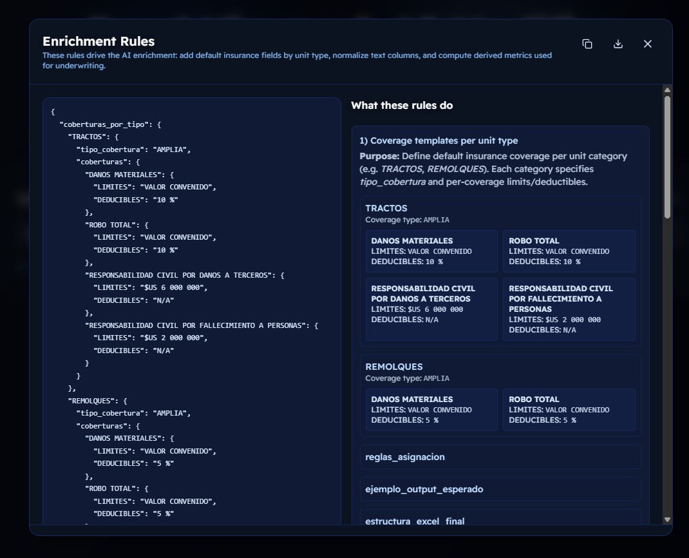
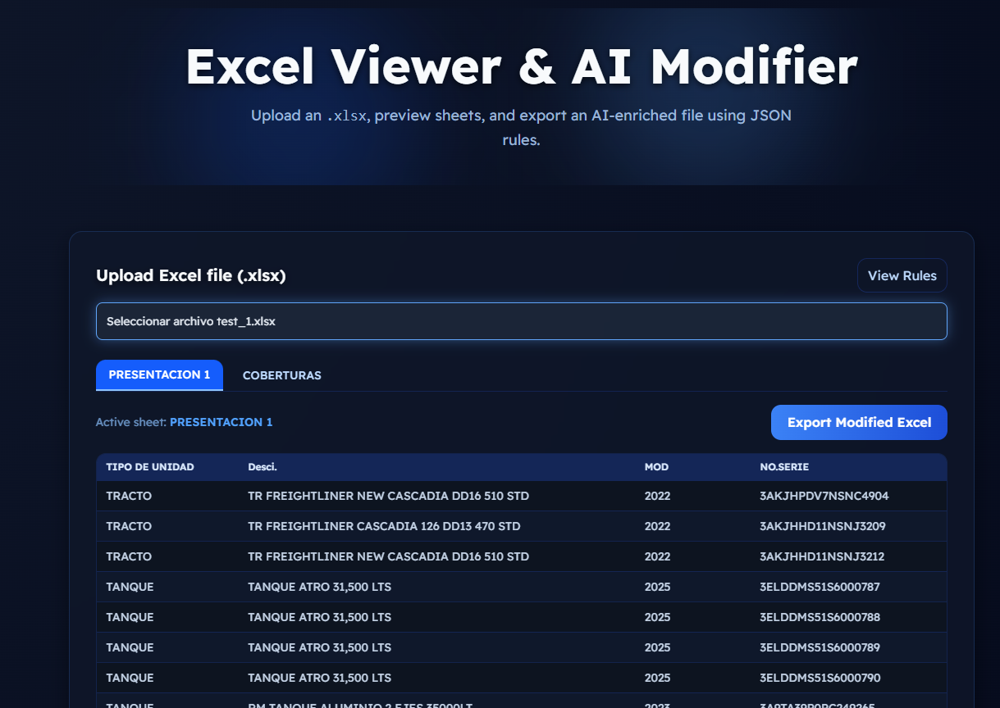

# Excel Viewer & AI Modifier — Frontend (Next.js + TypeScript)

This repository contains the frontend implementation of the **Excel Viewer & AI Modifier** application.
The web interface allows users to upload Excel files, navigate between sheets, view tabular data, and export an enriched version processed by an AI-assisted backend.

---

## Overview

The frontend is built with **Next.js 15 (App Router)** and **TypeScript**, using **TailwindCSS** for styling.
It focuses on clarity, modularity, and clean interaction with the FastAPI backend.

The application demonstrates an AI-driven workflow for enriching insurance fleet data through a combination of deterministic rules and optional LLM integration.

---

## Features

* Upload any `.xlsx` file and preview its sheets.
* Switch between sheets using an interactive **tab navigation system**.
* Display sheet data dynamically in a responsive HTML table.
* Retrieve enrichment rules from the backend.
* Export a modified version of the Excel file enriched by the backend.
* Lightweight, responsive UI using TailwindCSS.
* Real API communication with backend endpoints:

  * `/api/sample-data` → fetches rule definitions
  * `/api/export` → sends Excel and retrieves enriched version

---

## Architecture

```
frontend/
│
├── public/                      # Static assets and screenshots
│   ├── image1.png               # UI view: upload screen
│   ├── image2.png               # Sheet tab navigation
│   ├── image3.png               # DataTable display
│   ├── image4.png               # Export modal
│   ├── image5.png               # Rules modal (AI enrichment info)
│   ├── image6.png               # Final download confirmation
│
├── src/
│   ├── app/
│   │   ├── api/                 # Route handlers
│   │   │   ├── csrf/route.ts    # CSRF protection (Next.js App Router)
│   │   │   ├── export/route.ts  # Proxy to backend /export
│   │   │   └── sample-data/route.ts # Proxy to backend /sample-data
│   │   ├── layout.tsx           # Root layout (Tailwind, global styling)
│   │   └── page.tsx             # Main entry point and app structure
│   │
│   ├── components/
│   │   ├── DataTable.tsx        # Renders Excel data into table
│   │   ├── SheetTabs.tsx        # Tabs for navigating between sheets
│   │   ├── Hero.tsx             # Header section and introductory message
│   │   ├── RulesButton.tsx      # Button that opens the rules modal
│   │   └── RulesModal.tsx       # Modal that displays the JSON rules
│   │
│   ├── lib/
│   │   └── api.ts               # Utility functions for API communication
│   │
│   └── types/
│       └── index.d.ts           # Shared type definitions
│
├── .env.local                   # Backend URL configuration
├── next.config.ts
├── tailwind.config.js
├── tsconfig.json
├── package.json
└── README.md
```

---

## Technologies Used

* **Next.js 15** (App Router)
* **React 18**
* **TypeScript**
* **TailwindCSS**
* **SheetJS (xlsx)** for Excel parsing
* **Axios / Fetch API** for backend communication

---

## Core Workflow

1. **Upload Excel**
   The user selects a `.xlsx` file using the file input.
   The frontend parses it client-side via **SheetJS** and displays sheet names.

2. **View Sheets**
   The user can switch between sheets via the **SheetTabs** component.
   The data is rendered dynamically in **DataTable.tsx**.

3. **View Rules**
   Clicking the “View Rules” button opens the **RulesModal**, which retrieves and displays the enrichment JSON from `/api/sample-data`.

4. **Export Modified Excel**
   When the user clicks “Export Modified Excel”, the selected sheet data is sent to `/api/export`.
   The backend processes the file (via AI or deterministic rules) and returns a new enriched Excel file for download.

---

## API Integration

The frontend uses **Next.js route handlers** (`src/app/api/...`) as lightweight **proxies** to the FastAPI backend, ensuring CORS safety and simplicity:

```ts
// Example: src/app/api/export/route.ts
export async function POST(request: Request) {
  const formData = await request.formData();
  const backendResponse = await fetch(`${process.env.NEXT_PUBLIC_API_URL}/export`, {
    method: 'POST',
    body: formData,
  });
  const blob = await backendResponse.blob();
  return new Response(blob, {
    headers: { 'Content-Disposition': 'attachment; filename="modified.xlsx"' },
  });
}
```

This setup isolates backend URLs and allows seamless deployment of both projects.

---

## Visual Overview

Below are the main screens captured from the `/public` directory:

| Image                          | Description                             |
| ------------------------------ | --------------------------------------- |
|  | Initial upload interface                 |
|  | Modal rules                             |
|  | Sheet tab navigation                    |
|  | Data table rendering                    |
|  | Export button and processing            |
|  | Excel modified                          |
|  | Excel modified                          |

---

## Styling

* Global styling is managed in `globals.css` and `page.module.css`.
* Tailwind utility classes handle layout, spacing, and responsive behavior.
* The interface follows a minimal and clean visual structure, consistent with technical assessment requirements.

---

## Running the App Locally

### 1. Install dependencies

```bash
npm install
```

### 2. Create `.env.local`

```bash
NEXT_PUBLIC_API_URL=http://localhost:8000
```

### 3. Run the development server

```bash
npm run dev
```

Access at:

```
http://localhost:3000
```

---

## Example Backend Integration

If you run both apps locally:

* **Frontend:** [http://localhost:3000](http://localhost:3000)
* **Backend (FastAPI):** [http://localhost:8000](http://localhost:8000)

When exporting, the frontend calls:

```
POST http://localhost:3000/api/export → proxies → http://localhost:8000/export
```

---

## Project Goals

* Demonstrate full-stack proficiency connecting a React-based frontend with a FastAPI backend.
* Showcase AI-assisted data enrichment through modular JSON rule sets.
* Ensure clean architecture, scalability, and maintainability across both layers.

---

## Author

**Carmen Cecilia León**
Full-Stack Developer and Software Engineer
GitHub: [@kaikrmen](https://github.com/kaikrmen)

