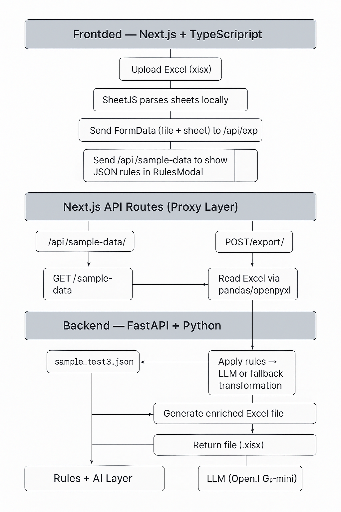

# Excel Viewer & AI Modifier

A full-stack application that allows users to **upload, view, and enrich Excel files** through an **AI-assisted backend**.
The project is divided into two components:

* **Frontend:** Next.js + TypeScript
* **Backend:** FastAPI + Python

The goal is to demonstrate a clear architecture, clean data handling, and modular AI-assisted transformation logic.

---

## 1. Overview

This application allows users to:

1. Upload an Excel file (`.xlsx`)
2. View all available sheets as tabs
3. Display sheet data dynamically as a table
4. Enrich or modify the data based on **JSON-defined rules** or via **LLM (OpenAI API)**
5. Export and download the enriched Excel file

The enrichment logic simulates an **insurance underwriting AI system**, adding or modifying fields such as coverage limits and deductibles based on fleet unit types.

---

## 2. Architecture Diagram



**Data Flow Summary:**
1. The frontend parses Excel locally to preview its content.
2. The backend enriches the same Excel file using the JSON rule definitions or OpenAI API.
3. The enriched Excel is returned for download.

---

## 3. Repository Structure

```
/
├── backend/
│   ├── app/
│   │   ├── core/                # Environment & security configuration
│   │   ├── routers/             # API routes (/sample-data, /export)
│   │   ├── services/            # AI logic, transformations, and rule utilities
│   │   └── main.py              # FastAPI entry point
│   ├── data/sample_test3.json   # Enrichment rules
│   ├── tests/                   # Unit tests (pytest)
│   ├── requirements.txt
│   ├── Dockerfile
│   └── .env
│
├── frontend/
│   ├── src/app/                 # Next.js App Router
│   │   ├── api/                 # Proxy routes for backend
│   │   ├── components/          # UI components (DataTable, SheetTabs, Modals)
│   │   ├── lib/                 # API utilities
│   │   └── page.tsx             # Main app
│   ├── public/                  # Screenshots and static assets
│   ├── package.json
│   └── tailwind.config.js
│
├── README.md                    # Root-level documentation
└── .gitignore
```

---

## 4. Tech Stack

| Layer        | Technology                   | Purpose                             |
| ------------ | ---------------------------- | ----------------------------------- |
| **Frontend** | Next.js + React + TypeScript | User interface, Excel visualization |
|              | TailwindCSS                  | Responsive styling                  |
|              | SheetJS (xlsx)               | Excel parsing client-side           |
| **Backend**  | FastAPI (Python 3.13)        | API endpoints                       |
|              | pandas / openpyxl            | Excel read/write                    |
|              | OpenAI API (optional)        | AI enrichment logic                 |
|              | Docker                       | Deployment                          |
| **Testing**  | pytest                       | Backend unit testing                |

---

## 5. Backend Overview

The FastAPI backend handles all **data transformation and enrichment** logic.

### Endpoints

| Method | Path           | Description                                            |
| ------ | -------------- | ------------------------------------------------------ |
| `GET`  | `/sample-data` | Returns the JSON enrichment rules                      |
| `POST` | `/export`      | Receives an Excel file and returns an enriched version |

### Key Modules

| Module                 | Responsibility                                         |
| ---------------------- | ------------------------------------------------------ |
| `llm_service.py`       | Integrates OpenAI API or deterministic fallback logic  |
| `rules_utils.py`       | Loads and validates enrichment rules                   |
| `transform_service.py` | Applies the transformations on DataFrames              |
| `export.py`            | Routes connecting frontend requests with core services |

### Environment Example (`.env`)

```
OPENAI_API_KEY=sk-xxxx
OPENAI_MODEL=gpt-4o-mini
BACKEND_API_KEY=my_secret
```

### Run Locally

```bash
cd backend
pip install -r requirements.txt
uvicorn app.main:app --reload --port 8000
```

---

## 6. Frontend Overview

The Next.js frontend provides an intuitive interface for users to upload and explore Excel files.

### Core Components

| Component                            | Description                                |
| ------------------------------------ | ------------------------------------------ |
| `Hero.tsx`                           | Header and upload section                  |
| `DataTable.tsx`                      | Displays Excel sheet data dynamically      |
| `SheetTabs.tsx`                      | Allows sheet navigation                    |
| `RulesButton.tsx` & `RulesModal.tsx` | Displays and retrieves JSON rules          |
| `api/route.ts`                       | Proxies API requests to the backend        |
| `lib/api.ts`                         | Handles API communication and file uploads |

### Environment Example (`.env.local`)

```
NEXT_PUBLIC_API_URL=http://localhost:8000
```

### Run Locally

```bash
cd frontend
npm install
npm run dev
```

Access at:

```
http://localhost:3000
```

---

## 7. AI Enrichment Logic

The enrichment logic uses a hybrid approach:

1. **Deterministic Rules (Default)**
   Applies transformations defined in `sample_test3.json`.

2. **LLM Mode (Optional)**
   If an OpenAI API key is available, the backend prompts an LLM to interpret and apply the same rules dynamically, returning JSON-formatted data.

Example Prompt:

```python
prompt = f"""
You are an AI underwriter in fleet insurance.
Rules:
{rules_json}

Excel sheet:
{sheet_data}

Apply the rules and return enriched rows as JSON.
"""
```

---

## 8. Tests

The backend includes unit tests for:

| Test File                   | Coverage             |
| --------------------------- | -------------------- |
| `test_api.py`               | API routes           |
| `test_llm_path.py`          | LLM service logic    |
| `test_rules_utils.py`       | JSON rule validation |
| `test_transform_service.py` | Data transformations |

Run all tests:

```bash
pytest -q
```

Expected:

```
.......                                                                                                           [100%]
7 passed in 0.39s
```

---

## 9. Docker Deployment

A ready-to-use Docker setup is provided for the backend:

```bash
cd backend
docker build -t excel-ai-backend .
docker run -p 8000:8000 excel-ai-backend
```

Frontend can be deployed independently on **Vercel** or **Netlify**, using the environment variable:

```
NEXT_PUBLIC_API_URL=https://your-backend-url
```

---

## 10. Improvements and Future Work

* Add authentication for multi-user environments.
* Extend LLM prompt logic for more complex enrichment scenarios.
* Improve Excel style preservation (formatting, merged cells).
* Add persistence layer for saving user-modified datasets.
* Integrate file version history for enriched Excel outputs.

---

## Author

**Carmen Cecilia León**
Full-Stack Developer and Software Engineer
GitHub: [@kaikrmen](https://github.com/kaikrmen)
